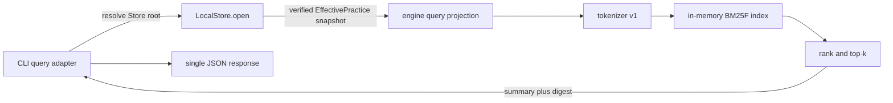

# ADR 0010: Keyword query retrieval contract

- **Date:** 2026-09-07
- **Status:** Accepted
- **Related:** issue [#53](https://github.com/lorelum/lorelum/issues/53), Query roadmap [#51](https://github.com/lorelum/lorelum/issues/51), ADR 0003 (Practice format), ADR 0004 (CLI protocol), ADR 0007 (LocalStore)

## Context

`lore get` can read one complete installed Practice by exact ID. The next useful
retrieval capability is `lore query`: an Agent describes its task and current
moment, receives a small ranked list, and then uses `get` for the full guidance.

The first query milestone must work offline from a healthy LocalStore without a
configuration file, model download, Embedding provider, network request, or
persistent retrieval index. It must still handle natural-language input more
carefully than substring search: Practice bodies vary greatly in length, uncommon
technical terms carry more signal than common words, and `title` or
`applies_when` matches should normally outweigh incidental body matches.

The current LocalStore already materializes every Effective Practice during a
verified cold open. At the expected first-stage scale, an in-process lexical
index adds less lifecycle risk than another persisted database. A persisted
index would require its own versioning, invalidation, migration, publication,
and crash-recovery contract before it could be trusted.

This ADR freezes M1 keyword behavior and the boundary used by its implementation.
It does not claim semantic understanding. Natural-language input is accepted,
but only normalized lexical terms can match in this milestone.

## Decision

### 1. Command contract

The CLI adds:

```sh
lore query "implement a settings page with permission checks" --top-k 5
lore --store-root /path/to/isolated-store query "HTTPClient token refresh"
```

The command has one required positional `query` and one command option:

- `--top-k <count>` defaults to `5`. An explicit value must match
  `^[1-9][0-9]*$`, parse to a JavaScript safe integer, and fall within `1..50`.
  Both `--top-k 5` and `--top-k=5` are accepted; `05`, `+5`, `1.0`, `1e1`,
  Unicode digits, an empty value, and repeated `--top-k` options are invalid.
- The query is trimmed before retrieval. An empty or whitespace-only query is
  invalid. More than 4096 Unicode code points is also invalid.
- A nonblank query that produces no tokenizer terms, such as punctuation alone,
  is valid and returns an empty result.
- Missing or extra positionals, an invalid query, an invalid `top-k`, or an
  invalid option fails before the Store is opened.
- Multiword shell input must be passed as one argument. Shell quoting is a
  caller concern and is shown in discoverable usage and documentation.

The existing protocol envelope is unchanged. Successful `data` has this shape:

```json
{
  "mode": "keyword",
  "results": [
    {
      "id": "agentic-coding.testing.classify-failure-before-changing-test",
      "title": "Classify the failure before changing the test",
      "stage": "testing",
      "tech_stack": ["typescript"],
      "applies_when": "A test fails while implementing or refactoring behavior.",
      "severity": "warn",
      "contentDigest": "0123456789abcdef0123456789abcdef0123456789abcdef0123456789abcdef"
    }
  ]
}
```

The registry result schema freezes the same shape. Both the top-level `data`
object and each hit set `additionalProperties: false`; all displayed properties
are required. `mode` is the constant string `keyword`. `results` is an array of
objects with these constraints:

| Property        | Schema and source constraint                                           |
| --------------- | ---------------------------------------------------------------------- |
| `id`            | string; a canonical Practice ID matching `ID_REGEX`                    |
| `title`         | string                                                                 |
| `stage`         | string                                                                 |
| `tech_stack`    | array of strings                                                       |
| `applies_when`  | string                                                                 |
| `severity`      | one of `info`, `warn`, `critical`; LocalStore has expanded the default |
| `contentDigest` | string; exactly 64 lowercase hexadecimal SHA-256 characters            |

The v1 registry schema vocabulary can express the object, required, array,
string, constant, and enum constraints. ID and digest lexical constraints are
enforced by their canonical producers and explicit tests until the shared
schema vocabulary gains a `pattern` keyword.

Results are ordered from most to least relevant and contain at most `top-k`
entries. A hit contains the fields an Agent needs to decide whether to call
`get`; it excludes `body`, anti-pattern details, source paths, and internal
canonical serialization. `contentDigest` has the same meaning and encoding as
the existing `get` result.

M1 does not publish raw score, matched fields, snippets, total match count,
query text, Store generation, effective revision, tokenizer version, or
algorithm version. These values either expose unstable ranking internals,
duplicate caller input, or suggest pagination/snapshot guarantees that do not
exist. Array order is the public ranking signal. `mode: "keyword"` states the
quality class actually used.

Empty Store and no-match outcomes are successful results with `results: []` and
exit code `0`. They are not `practice.not-found` failures. Store integrity is
verified before an empty result is returned.

Failures use the existing single-line failure envelope and exit code `2`:

| Error code                | Meaning                                                               |
| ------------------------- | --------------------------------------------------------------------- |
| `usage.invalid`           | The query, argument count, `top-k`, or option syntax is invalid.      |
| `store.busy`              | A stable Store snapshot could not be obtained during concurrent work. |
| `store.recovery-required` | The selected Store could not be opened and recovered normally.        |
| `runtime.unexpected`      | An undeclared internal failure prevented completion.                  |

Visible error messages do not echo query text, paths, or internal error details.
M1 has no successful exit-code-`1` outcome.

### 2. Query-to-get consistency

`query` and the following `get` must be invoked with the same effective
`--store-root`. Every invocation independently opens and verifies the selected
LocalStore. One query uses one immutable in-memory snapshot, but separate
commands can observe different revisions.

Each hit therefore includes `contentDigest`. After `get <id>`, a caller that
requires consistency compares the returned digest with the query hit:

- equal digests mean the canonical Practice content is the same;
- a different digest means the Practice changed and the caller should re-query;
- `practice.not-found` means the Practice was removed and the caller should
  re-query.

This detects canonical content changes; it does not pin a revision or describe
source-only changes. M1 adds no version-pinning argument to either command.

### 3. Retrieval text projection

The index is built from the canonical Practice snapshot within each
`EffectivePractice`. Pack files are never reparsed, and source claims do not
participate in ranking.

The `keyword-projection-v1` fields, boosts, and length-normalization factors are:

| Field           | Text included                                             | Boost |  `b` |
| --------------- | --------------------------------------------------------- | ----: | ---: |
| `id`            | Practice ID                                               |   5.0 | 0.00 |
| `title`         | title                                                     |   4.0 | 0.30 |
| `applies_when`  | applicability text                                        |   3.0 | 0.50 |
| `tech_stack`    | each array entry                                          |   2.5 | 0.00 |
| `stage`         | free-form stage label                                     |   2.0 | 0.00 |
| `anti_patterns` | each anti-pattern's `id`, `name`, and `description`       |   2.0 | 0.50 |
| `body`          | canonical Markdown body, including code and visible prose |   1.0 | 0.75 |

Severity and provenance are excluded because they do not describe subject
matter. `canonicalContent` is not indexed as JSON: doing so would duplicate all
fields and introduce property-name and punctuation noise. `stage` remains a
free-form lexical field, and `applies_when` remains text; neither becomes a
structured filter in M1.

### 4. Tokenizer v1

Query and document fields use the same `keyword-tokenizer-v1`. It is implemented
inside the engine without a language-specific runtime dependency.

1. Normalize text with Unicode NFKC. Preserve original case long enough to
   detect identifier boundaries, then use Unicode lowercase for matching.
2. Scan maximal technical surface tokens with
   `[\p{L}\p{N}]+(?:[._/:-][\p{L}\p{N}]+)*` using Unicode mode. Emit each
   normalized surface token once. Whitespace and other punctuation end the
   surface token.
3. Produce a second component stream from that same surface token: split at the
   five separators, then at lowercase-or-number → uppercase,
   uppercase-acronym → capitalized-word, letter → number, and number → letter
   boundaries. Lowercase and emit every nonempty component. Thus separators
   are component boundaries while the complete surface token remains available
   for exact technical matching.
4. Split mixed Latin/number and CJK script runs before applying their respective
   rules.
5. For each contiguous Han, Hiragana, Katakana, or Hangul run, emit overlapping
   character bigrams. Emit a unigram only when the run contains one character.
6. Do not remove stop words and do not apply stemming, synonym expansion,
   translation, fuzzy edit distance, or phrase matching.

Examples are normative at the token-presence level:

| Input               | Required terms include                     |
| ------------------- | ------------------------------------------ |
| `HTTPClient`        | `httpclient`, `http`, `client`             |
| `local_storage`     | `local_storage`, `local`, `storage`        |
| `api.auth-token`    | `api.auth-token`, `api`, `auth`, `token`   |
| `接口请求`          | `接口`, `口请`, `请求`                     |
| `remote接口Request` | `remote`, `接口`, `request`                |
| `Qwen3Embedding`    | `qwen3embedding`, `qwen`, `3`, `embedding` |

After separator and mixed-script splitting, the case/number component split is
equivalent to inserting boundaries with these Unicode regular expressions in
order, then lowercasing and removing empty components:

```text
([\p{Ll}\p{N}])(\p{Lu})  -> $1 | $2
(\p{Lu})(\p{Lu}\p{Ll})   -> $1 | $2
(\p{L})(\p{N})            -> $1 | $2
(\p{N})(\p{L})            -> $1 | $2
```

If surface and component streams emit the same normalized term for one source
occurrence, it contributes one occurrence. Repeated appearances at different
source positions still increase document term frequency.

Document term frequency counts repeated source occurrences. Query terms are
deduplicated before scoring, so repeating one word cannot amplify that word's
contribution. Token order does not affect M1 ranking.

This tokenizer improves literal matching for Chinese and technical identifiers.
It does not make Chinese text match an English synonym or make `authorization`
match `permissions`; those are semantic-retrieval concerns.

### 5. BM25F ranking

M1 builds an in-memory inverted index for the verified Effective Practice
snapshot and applies field-weighted BM25F. No third-party retrieval dependency
is required.

For query term `t`, document `d`, and field `f`:

```text
normalizedTf(t,d,f) = tf(t,d,f) /
  (1 - b[f] + b[f] * fieldLength(d,f) / averageFieldLength(f))

weightedTf(t,d) = Σf boost[f] * normalizedTf(t,d,f)

idf(t) = ln(1 + (N - df(t) + 0.5) / (df(t) + 0.5))

termScore(t,d) = idf(t) *
  ((k1 + 1) * weightedTf(t,d)) / (k1 + weightedTf(t,d))

score(d) = Σt termScore(t,d)
```

`N` is the number of Effective Practices, `df(t)` counts Practices containing
the term in any indexed field, and `k1` is `1.2`.
`averageFieldLength(f)` is the sum of that field's token counts divided by `N`,
including Practices where the field is empty. A missing or empty field has
`fieldLength = 0` and `tf = 0`. When `N = 0`, retrieval returns no candidates
before evaluating the formula. If a field's average length is zero, its
normalization denominator is defined as `1`; its term frequencies are already
zero. The fixed `b` values otherwise keep every denominator positive.

Computation uses JavaScript numbers. An index invariant violation or non-finite
intermediate is an internal typed failure, surfaced by the CLI as
`runtime.unexpected`; implementations must not silently discard or clamp it.

Only documents with a score greater than zero are candidates. Candidates sort
by descending score, then by ascending Practice ID using deterministic Unicode
code-unit comparison rather than locale-sensitive collation. The top `k` are
projected to public hits after sorting. Corpus composition can legitimately
change BM25F scores and ranking because IDF and average field length are
corpus-relative.

The implementation records the internal algorithm identity
`keyword-bm25f-v1`. It is not emitted in the M1 CLI schema. A later ranking
change requires quality/performance comparison and design review because rank
order is observable, even though the numeric score is private.

### 6. Package and runtime architecture

The dependency direction remains `cli → engine → format`:



The target implementation owns these responsibilities:

- `packages/engine/src/query/` owns projection, tokenization, index construction,
  BM25F scoring, deterministic ranking, request/result types, and pure tests.
- The engine exports a narrow pure operation equivalent to
  `queryKeywordPractices(effectivePractices, { text, limit })`. It has no
  Commander, process I/O, filesystem discovery, or network dependency. Public
  hits do not expose the internal score or index representation.
- `packages/cli/src/query/` owns option decoding, result JSON Schema, Store error
  translation, and the command definition. It uses
  `resolveInvocationStorageRoot`; it never calls `defaultStorageRoot` to bypass
  the invocation override.
- The CLI opens LocalStore exactly once, then passes that snapshot's
  `effectivePractices` to the engine. It does not parse Pack artifacts, query
  SQLite tables directly, or maintain a second content source.
- Registry/discovery metadata is the single source for parser construction,
  usage, result schema, visible errors, and exit codes.

A future long-running MCP adapter may reuse the engine operation but must define
how it notices Store changes and reuses or rebuilds an in-memory index. The CLI's
cold-open-per-invocation policy is not an MCP cache contract.

### 7. Verification and evidence

The implementation issue and PR must include the following evidence.

**Behavior tests**

- tokenizer unit tests for English case, Chinese, mixed scripts, dotted IDs,
  kebab/snake identifiers, camelCase/PascalCase, acronym boundaries, and numeric
  model names;
- ranking tests for field boosts, rare-term IDF, body length normalization,
  repeated query terms, zero matches, `top-k`, and deterministic ID tie-breaks;
- empty Store, punctuation-only query, blank/oversized input, and invalid
  `top-k` behavior;
- registry/discovery, result-schema, visible-error, single-line JSON, and
  explicit Store-root isolation tests;
- a compiled-process `query → get` test that uses an isolated Store and compares
  `contentDigest`;
- no unit or integration test reads the user Store or accesses the network.

**Quality baseline**

- Commit a public contract fixture with at least 20 fixed queries and relevance
  labels covering positive, paraphrase, near-miss, Chinese, mixed-language, and
  technical-identifier cases. Each lexical-positive query identifies one
  primary relevant Practice and may identify additional relevant Practices.
  The implementation passes with primary-target Recall@5 = `1.0` and MRR@5 ≥
  `0.80` on those lexical-positive cases.
- Semantic-only paraphrases that share no tokenizer term are a separately named
  expected-miss set. Report their Recall@5, but exclude them from the M1 pass
  threshold instead of relabeling a lexical miss as success.
- Store the corpus, queries, labels, tokenizer/projection/algorithm identities,
  and a repeatable evaluation command in the repository so later algorithms
  run the same comparison.
- Optionally assess real immutable public Packs in an isolated Store, but do not
  commit private Packs, queries, relevance labels, or traces.

**Performance baseline**

- Provide a repeatable `bun run benchmark:query -- --sizes 1000,5000` command.
  It uses a fixed seed and synthetic Practices with all indexed fields plus an
  average body size of 2 KiB.
- Report Store open/materialization, index build, search, compiled CLI
  end-to-end latency, and peak memory separately. Use warmups and report median
  plus p95 over at least 30 measured runs after 5 warmups, with runtime, OS,
  CPU, corpus size, and measurement method.
- On the implementation PR's stated reference machine, the 5,000-Practice
  index-build p95 must be at most 2 seconds, search p95 at most 100 ms, compiled
  CLI end-to-end p95 at most 3 seconds, and additional peak resident memory at
  most 256 MiB. The 5,000/1,000 median index-build ratio must be at most 7.
- Add a generous automated shape test in which building 5,000 Practices and
  executing 20 fixed queries completes within 5 seconds. This is a regression
  alarm rather than the product SLO; measured baselines remain the comparison
  evidence for later ranking or index changes.

Retrieval quality, command correctness, and downstream Agent behavior remain
separate evidence claims. Passing command tests does not prove semantic recall
or improved Agent decisions.

### 8. Explicit M1 boundaries

M1 does not add:

- config files or a `config` command;
- local or remote Embedding providers, credentials, model downloads, or network
  fallback;
- LocalStore schema changes, SQLite FTS, a persistent lexical index, vector
  tables, or outbox consumption;
- semantic/hybrid mode flags, structured filters, reranking, query rewriting,
  synonyms, translations, snippets, or pagination;
- MCP tool registration or a long-running index cache;
- changes to Practice/Pack schemas or `get` behavior.

Future semantic retrieval will use a profile-isolated derived index. Hybrid
retrieval will combine independently ranked lexical and vector candidate lists,
for example with reciprocal-rank fusion; it must not add BM25F and cosine scores
as though they shared a scale. Keyword query remains available when semantic
infrastructure is absent or unhealthy.

## Consequences

**Positive:** M1 is useful offline, deterministic for one snapshot, inexpensive
to operate, and isolated from later provider/configuration work. BM25F handles
field importance, term rarity, and body length without a new dependency.
`contentDigest` gives query/get callers a practical way to detect content drift.

**Negative / accepted risk:** index construction is repeated for every CLI
invocation, lexical matching misses synonyms and cross-language equivalents,
and corpus-relative scoring can reorder unchanged Practices when the corpus
changes. CJK bigrams also create more terms than whitespace tokenization.
Benchmarks determine when persistence or caching becomes justified.

**Follow-ups:** implement this contract in a separate issue/PR; record the first
quality and performance baselines; then proceed independently with configuration,
Embedding profiles, recoverable derived storage, and semantic/hybrid retrieval
as ordered by the Query roadmap.
