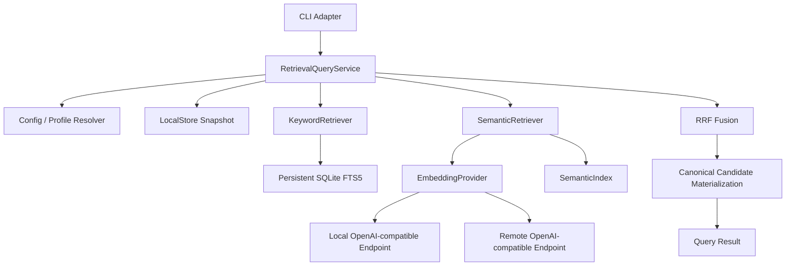

# Lorelum Query 实现现状与功能路线

- 状态：Proposed，待维护者审查
- 更新日期：2026-09-10
- 代码基线：`origin/main@bfdd5fba6449d6a7f493c7726c4e22c16d440fa6`
- 关联 Issue：[#83](https://github.com/lorelum/lorelum/issues/83)
- 范围：从已交付的关键词 Query 推进到 Semantic Query 和 Hybrid Query

## 1. 结论

Lorelum 已经完成可用的离线关键词检索，并解决了跨 CLI 进程重复建立 FTS5 索引的问题。当前主线不再是继续优化关键词基础设施，也不应让 FTS5 与 MiniSearch 的研究阻塞功能推进。

接下来按用户可见能力推进：

1. **交付 Semantic Query v1：用最小 config、Embedding profile/provider、向量索引和显式 semantic 模式组成端到端功能。**
2. **交付 Hybrid Query：在同一 Store 快照内融合关键词与向量召回。**
3. **用真实评测决定是否增加 reranker、query rewrite、多视图或 ANN。**

内部可以拆成多个小 PR，但不能把 config、provider 和向量数据库各自做成长期停留的基础设施阶段。Semantic 阶段的完成标准是用户能够真正执行一次语义查询并得到可验证结果。

## 2. 最终目标

CLI：

```sh
# 零配置、完全离线，继续作为默认行为
lore query "React 登录页怎么接认证"

# 显式使用已准备好的语义 profile
lore query "如何避免组件直接请求接口" --mode semantic --profile local-multilingual

# 同一快照内融合词法和向量召回
lore query "how should auth tokens be refreshed" --mode hybrid --profile local-multilingual

# 检查和构建语义索引
lore index status --profile local-multilingual
lore index build --profile local-multilingual
```

Query 返回候选摘要，完整正文仍通过 `get` 获取。LocalStore 始终是 Practice 内容、digest 和来源的事实来源。

## 3. 当前已经完成

### 3.1 Get

- `lore get <practiceId>` 已合入 `main`。
- 使用 SQLite 索引点查 canonical Practice。
- 返回完整正文、`contentDigest` 和来源。
- 不依赖关键词或向量索引。

### 3.2 Keyword Query

- `lore query <text> [--top-k]` 已合入 `main`。
- 使用 SQLite FTS5 和 `bm25()`，不自行实现倒排索引或 BM25。
- 支持 Unicode NFKC、技术标识符拆分和 CJK bigram。
- 返回摘要与 `contentDigest`，不返回正文和内部 score。
- 默认离线运行，不读取 config、不调用模型、不访问网络。

### 3.3 持久关键词索引

关键词索引已经持久化在：

```text
<store-root>/indexes/keyword/v1/active.sqlite
```

- 第一次 query 从完整一致快照构建。
- 后续 CLI 进程复用已有索引。
- install、upgrade、uninstall 后，下一次 query 消费连续 revision delta，只更新受影响的 Practice。
- LocalStore mutation 也已经改成按受影响 Practice ID 更新 canonical projection。
- Query 命中后只回读并校验候选 canonical Practice。

20,000 条合成 Practice 的 compiled query p95 当前观测从约 1,049ms 降到约 72ms，峰值 RSS 从约 421MiB 降到约 59MiB。20,000 条新方案只有 5 个样本，因此这些数字用于证明持久复用方向有效，不是最终 SLO。

PR #81 已完成独立的 compiled LocalStore mutation benchmark。在 20,000 条基线下，单 Practice add/change/remove 的 p95 分别约为 53ms、43ms 和 49ms，逻辑物化与写入量在 1,000、5,000、20,000 条下保持一致。关键词查询和内容更新已经具备继续推进新检索能力的工程基础。

### 3.4 尚未实现

- 产品化 config schema 和 `lore config`。
- Embedding profile 和 provider。
- 向量存储、构建、状态与恢复。
- `semantic` 和 `hybrid` 查询模式。

## 4. 目标架构



### 4.1 RetrievalQueryService

当前 `QueryService` 只有 keyword 模式。加入第二种召回源后，将它演进为统一的检索用例边界：

- 校验 query、mode、top-k 和 profile。
- 固定本次请求使用的 Store 快照。
- 调用 KeywordRetriever、SemanticRetriever 或两者。
- 在 hybrid 模式中执行 RRF。
- 从同一 LocalStore 快照批量读取候选。
- 校验 ID 和 `contentDigest` 后组装摘要。

Hybrid 不能通过分别执行一次完整 keyword query 和 semantic query 再拼接实现，否则两组候选可能来自不同 Store 快照。

### 4.2 KeywordRetriever

直接复用当前持久 FTS5 实现。FTS5 与 MiniSearch 的比较保留为非阻塞研究，不进入 Semantic Query 的前置依赖。

### 4.3 SemanticRetriever

职责限定为：

1. 根据选定 profile 编码 query。
2. 打开与 Store 快照和 profile 匹配的向量索引。
3. 执行精确向量召回。
4. 返回候选 Practice ID、digest、rank 和内部相似度。

它不组装公开摘要，不读取 Pack 文件，也不处理来源冲突。

### 4.4 Config、Provider 和 SemanticIndex

- Config 表达用户选择和 provider 连接方式。
- EmbeddingProfile 表达不可变的向量空间身份。
- EmbeddingProvider 负责产生和验证向量。
- SemanticIndex 负责向量、Practice binding、快照身份和构建状态。
- LocalStore 继续只负责 canonical Practice，不执行或等待 Embedding。

## 5. 功能里程碑 Q1：Semantic Query v1

Q1 是一个端到端产品里程碑。下面四步可以拆 PR，但只有全部完成并通过真实模型验证后，才称为 Semantic Query 已交付。

### 5.1 最小配置与 Profile

建议 Store-scoped 配置：

```text
<store-root>/config.json
```

第一版只配置 Semantic Query 真正需要的字段：

```json
{
  "schemaVersion": 1,
  "profiles": {
    "local-multilingual": {
      "provider": "openai-compatible",
      "transport": "local",
      "baseUrl": "http://127.0.0.1:11434/v1",
      "model": "configured-model",
      "credentialEnv": null
    }
  }
}
```

配置合同：

- `--store-root` 继续决定 Store，不允许 config 重定向到另一个 Store。
- config 写入不联网、不下载模型、不构建索引。
- 凭证只保存环境变量或凭证存储引用，不保存明文 secret。
- `show` 和诊断不展开凭证值。
- 用户配置中的 profile 名是别名，不是向量空间身份。

需要的最小命令：

```text
lore config show
lore config set-profile
lore config remove-profile
```

不先建设通用任意 key-value 配置框架。

### 5.2 EmbeddingProfile 与 Provider

第一版实现一个窄的 OpenAI-compatible Embedding adapter，通过不同 `baseUrl` 同时覆盖用户管理的本地服务和远程服务。

本地模式：

- 模型进程、下载和生命周期由用户管理。
- Lorelum 只连接明确配置的本地 endpoint。
- 不在第一版内嵌 ONNX、Python、模型下载器或守护进程。

远程模式：

- 用户必须显式选择 remote profile。
- 构建索引会发送 Practice 检索文本；每次查询会发送 query 文本。
- 缺少凭证、超时、限流和非法响应都显式失败。
- 不自动切换到另一个在线服务。

`profileId` 必须由会改变向量空间或输入编码的字段确定性生成，至少包括：

- provider/deployment namespace。
- 模型 ID 与可取得的 revision。
- document/query 编码指令。
- 实际向量维度。
- pooling、归一化和 distance metric。
- 文本 projection、tokenizer 和 truncation 版本。
- 会改变输出的量化或运行时版本。

相同模型名或相同维度不能证明向量兼容。不同 `profileId` 的向量一律分开保存。

### 5.3 向量索引

建议布局：

```text
<store-root>/indexes/semantic/v1/<profileId>/active.sqlite
```

第一版能力：

- 每个 Practice 生成一个向量，先验证单向量投影是否足够。
- Float32 向量以 BLOB 保存在独立 SQLite 派生索引。
- 查询时加载匹配 profile 的向量并执行精确 cosine 或等价点积扫描。
- 不引入 ANN、外部向量数据库或独立搜索服务。
- 复用当前 Store root binding、snapshot identity、revision delta、writer lock、staging 和原子发布经验。
- added/changed 重新编码，invalidated 删除；source-only 变化不重新 Embedding。
- profile、projection 或编码合同变化时建立新索引，不原地混写。

用户控制能力：

```text
lore index status --profile <name>
lore index build --profile <name>
lore index rebuild --profile <name>
```

构建必须显式触发，尤其是 remote provider，避免一次普通 query 隐式产生费用或发送整个 Practice corpus。第一版可以以前台命令完成构建，不需要先引入 daemon 和持久任务队列。

### 5.4 Semantic Query

扩展 Query 请求：

```ts
type QueryMode = "keyword" | "semantic";

interface QueryRequest {
  readonly text: string;
  readonly limit?: number;
  readonly mode?: QueryMode;
  readonly profile?: string;
}
```

行为：

- 未指定 mode 时继续使用 `keyword`，不改变现有用户行为。
- semantic 必须选择一个 profile，并且该 profile 的索引与当前 Store 快照一致。
- query 编码必须使用构建该索引的同一 profile。
- 索引未构建、过期、provider 不可用或 profile 不兼容时显式失败。
- semantic 不静默降级为 keyword。
- 结果继续回读 canonical Practice，并返回实际执行的 mode 和 profile 身份。

### 5.5 Q1 完成标准

- 至少一个本地多语言模型和一个远程基线在同一公开评测集上真实运行。
- 中文查询英文 Practice、同义改写等已知词法失败案例得到可测量改善。
- profile 切换后不会复用另一向量空间。
- install、upgrade、uninstall 后索引状态和查询结果正确。
- compiled CLI 完成 config→build→semantic query→get 的真实进程流程。
- keyword 模式继续零配置、离线可用。

本地小模型是否“够用”由质量集决定，而不是由参数规模决定。对于当前最多数万条 Practice 的预计规模，精确向量扫描通常不是首要瓶颈；更关键的是多语言召回、输入投影、模型冷启动和索引构建成本。

## 6. 功能里程碑 Q2：Hybrid Query

### 6.1 行为

```sh
lore query "认证 token 刷新" --mode hybrid --profile local-multilingual
```

同一次请求中：

1. 固定一个 Store 快照。
2. KeywordRetriever 产生词法候选。
3. SemanticRetriever 产生向量候选。
4. 使用 RRF 按排名融合到 Practice ID。
5. 从同一快照读取最终 top-k canonical Practice。

不能直接相加 BM25 和 cosine score，因为它们没有共同尺度。

### 6.2 第一版约束

- hybrid 显式 opt-in，不自动替换默认 keyword。
- RRF 常数和两路候选预算先作为内部版本化参数。
- 不对用户公开 BM25/cosine 原始分数。
- 一路不可用时默认明确失败；只有未来增加显式 fallback 选项时才允许降级，并返回实际执行模式。
- 无匹配可以返回空结果，不强行填满 top-k。

### 6.3 完成标准

- 在同一保留评测集上同时报告 keyword、semantic、hybrid。
- Hybrid 在目标查询组上优于或至少不显著劣于最佳单路召回。
- 删除或更新后的 Practice 不会由旧向量继续召回。
- CLI 在重复执行和不同进程中返回相同的排序、摘要与 mode 语义。

## 7. 功能里程碑 Q3：按证据增强

只有真实失败案例证明需要时才引入：

| 观察到的问题                       | 后续能力                 |
| ---------------------------------- | ------------------------ |
| 正确候选已召回但排位差             | Cross-encoder reranker   |
| Query 表达与文档差异过大           | Query rewrite 或受控翻译 |
| 一个 Practice 同时包含多个独立主题 | 多视图或 chunk 向量      |
| 数万条精确扫描无法满足延迟目标     | ANN 或嵌入式向量扩展     |
| 本地模型冷启动过慢                 | 模型进程复用或连接池     |
| 多用户与高并发成为真实需求         | 独立检索服务             |

Tavily、Exa 一类 Web 检索服务解决外部互联网内容发现，不替代 Lorelum 对已安装 canonical Practice 的检索。Context7 的核心产品体验值得参考，但 Lorelum 仍需自己维护 Pack、Practice、LocalStore、profile 和可验证来源的产品边界。

## 8. 开源组件策略

| 能力              | 第一选择                       | 原因                                       |
| ----------------- | ------------------------------ | ------------------------------------------ |
| 关键词索引与 BM25 | 当前 SQLite FTS5               | 已交付、无新增服务、性能满足现阶段需求     |
| 技术文本预处理    | 当前薄适配                     | Practice ID 和技术标识符属于领域规则       |
| 中文通用分词      | `Intl.Segmenter` 或 Jieba 实验 | 只在质量提升可证明时替换当前 CJK bigram    |
| Embedding HTTP    | OpenAI-compatible 窄客户端     | 一个协议覆盖本地和远程部署，减少适配器数量 |
| 本地向量存储      | `bun:sqlite` Float32 BLOB      | 与现有工具链一致，易于版本化和恢复         |
| 初始向量检索      | 内存精确扫描                   | 当前规模下更易验证，不提前引入 ANN         |
| 混合融合          | 自有薄 RRF 函数                | 算法简单、确定、无必要引入完整 RAG 框架    |

不引入 LangChain、LlamaIndex 或完整 RAG 框架作为 Engine 核心依赖。它们擅长应用编排，但不能替代 Lorelum 已经拥有的 LocalStore 一致性、Pack 生命周期、profile 隔离和 CLI 合同；引入后反而会扩大依赖与抽象面。

## 9. 评测不是独立停工阶段

评测应跟随每个功能里程碑交付：

- Keyword 继续保留当前回归基线。
- Semantic 增加跨语言、同义词和表达改写样例。
- Hybrid 增加 lexical-only、semantic-only、两者冲突和无答案样例。
- 每个模型分别记录 profile、输入投影和结果，不把不同模型 score 直接比较。
- CLI 冷启动、首次构建、索引复用、增量更新、RSS 和磁盘占用分别测量。
- 最终还要验证 Agent 是否真正使用了相关 Practice，而不只看检索指标。

Issue #57 的 FTS5/MiniSearch 比较不作为下一里程碑。只有质量集显示关键词实现本身阻碍 Hybrid，才投入替换实验。

Issue #79 已由 PR #81 关闭，证明普通小 mutation 的逻辑工作量不再随完整 Store 规模增长；它不再是后续 Query 功能计划中的待办。

## 10. 建议拆分

| 顺序 | 工作项                         | 用户获得的能力                          |
| ---: | ------------------------------ | --------------------------------------- |
|    1 | Semantic Query v1 总体设计     | 冻结完整端到端合同，避免各模块分散演进  |
|    2 | 最小 config + EmbeddingProfile | 用户可声明本地或远程语义空间            |
|    3 | OpenAI-compatible provider     | Lorelum 可验证并调用真实 Embedding 模型 |
|    4 | Semantic index build/status    | 用户可显式构建、检查和恢复向量索引      |
|    5 | `query --mode semantic`        | 用户获得同义和跨语言检索                |
|    6 | `query --mode hybrid`          | 用户获得融合检索                        |
|    7 | 证据驱动的 rerank/rewrite/ANN  | 只解决已经观察到的质量或规模瓶颈        |

每个公共 CLI 合同和 retrieval model 变更先建立对应 Issue 并完成设计对齐。实现仍拆成小而可审查的 PR，但以端到端能力是否可演示作为里程碑完成标准。

## 11. 当前下一步

当前下一项工作应是：

> **启动 Semantic Query v1 的总体设计，并以可执行的 CLI 语义查询作为端到端交付目标。**

总体设计需要冻结以下五个决定：

1. Store-scoped config 的最小 schema 和命令。
2. EmbeddingProfile 的不可变身份。
3. local/remote OpenAI-compatible provider 的显式数据边界。
4. 向量索引的构建、状态、版本隔离与恢复。
5. semantic/hybrid 的 CLI、错误和降级语义。

这些决定通过维护者审查和设计对齐后，再进入实现。本文是功能规划，不代表示例中的 config、index、semantic 或 hybrid 命令已经实现。
