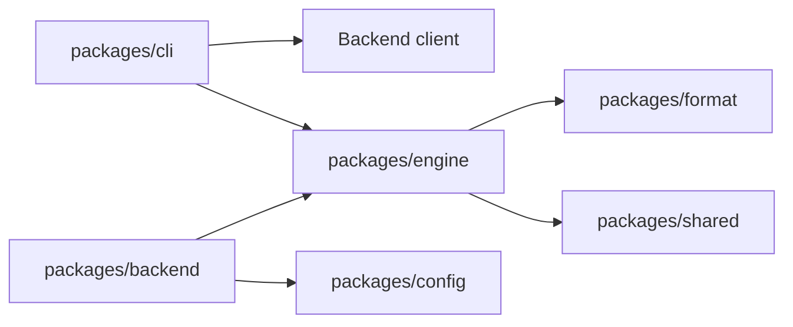
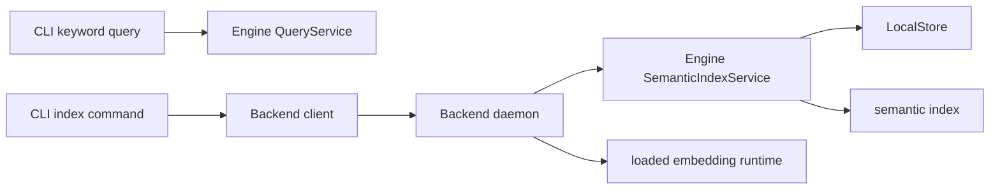

# Semantic Query v1：服务边界与 semantic index 阶段

状态：semantic index 阶段已在当前工作树实现，随 [Issue #111](https://github.com/lorelum/lorelum/issues/111) 评审；semantic query 仍是下一阶段。日期：2026-09-12。

## 当前结论

Engine 拥有检索语义和 Store 派生数据；Backend 是承载本地模型与长任务的服务进程；CLI 是命令入口、client 和 JSON 协议边界。

当前已实现的 semantic index 调用链为：

```text
CLI index command
  → Backend client
  → Backend index operation
  → Engine SemanticIndexService
  → LocalStore + semantic index
```

Backend 在进程内把已加载的 embedding runtime 适配给 Engine。Engine 不依赖 Backend、CLI、Elysia 或模型运行时。

当前仍未实现 semantic QueryService、`query --mode` 和默认 semantic query 路由；`lore query` 继续走 keyword 路径。

## 包依赖图



CLI 可以依赖 Engine 和 Backend；Backend 可以依赖 Engine；Engine 不得反向依赖 Backend 或 CLI。

## 运行时边界



keyword query 保持 `CLI → Engine`，维持零配置和离线行为。semantic index 使用 `CLI → Backend client → Backend daemon → Engine`。semantic query 的运行时路径留到下一阶段，不在本文预先定义新的 endpoint 或 query DTO。

## 责任与数据范围

| 区域                  | 责任                                                                     |
| --------------------- | ------------------------------------------------------------------------ |
| Engine LocalStore     | canonical Practice、来源、digest、Store snapshot 和 revision history     |
| Engine semantic index | Profile/Store binding、staging、增量 build、向量校验、原子发布和状态判定 |
| Backend               | daemon 生命周期、模型准备、index operation、busy 和错误映射              |
| CLI                   | 参数解析、`--store-root`、Backend client、operation 轮询和 JSON envelope |
| config                | 用户级模型配置和 Backend runtime 配置                                    |

模型配置、模型缓存和 Backend 地址是用户级数据；Store 和 semantic index 属于各自的 `--store-root`。index 是可删除、可重建的派生数据，不能作为 Practice 正文事实来源。

## semantic index 阶段的合同

- `index status` 读取 metadata 和 Store identity，不调用模型。
- `index build` 在 ready 时 no-op；stale 且 revision history 连续时只编码新增或 projection 变化的 Practice；不安全时全量构建。
- `index rebuild` 始终全量构建。
- Engine 在 staging 中完成更新和校验，随后在 Store snapshot fence 内原子替换 active index。
- Backend 一次只接受一个 build/rebuild；当前不持久化 operation，也不排队。
- Backend 未启动、模型未加载、向量非法、Store 变化或构建失败，都返回明确错误并保留旧 active。

详细增量规则见[Semantic index 增量 build](./semantic-index-incremental-build-design.md)。

## 目录归属

```text
packages/engine/src/query/semantic/index/
  service.ts       # no-op、增量、全量选择和发布
  incremental.ts   # affected IDs、删除、复用和编码
  database.ts      # SQLite staging、metadata、向量校验
  metadata.ts      # Profile/Store identity 和兼容性

packages/backend/src/modules/index/
  controller.ts        # HTTP DTO、认证和响应
  operation-service.ts # operation 生命周期与 busy
  model.ts             # status、operation schema

packages/cli/src/index/
  index-commands.ts    # index 命令、client 和轮询
```

Engine 业务逻辑不放在 Backend controller 中。

## 验收与开发入口

当前 worktree 的 Agent 验收直接执行：

```sh
bun packages/cli/src/main.ts --store-root /path/to/isolated-store index status
```

涉及 embedding 的验收先构建 native candidate，再显式启动 Backend、加载模型，最后执行 `index build`；不要使用全局 `lore` 或其他 worktree 的 binary。

必须验证空 Store、首次 build、ready no-op、增量新增/修改/删除、历史缺口全量恢复、Profile/root 隔离、Store snapshot fence、Backend busy 和进程中断。

## 后续范围

semantic query、默认 semantic 路由和 `--mode keyword`/`--mode semantic` 的完整合同，在 semantic index 验收后单独设计和实现。Backend 按需启动与仅本地模型加载见 [Issue #114](https://github.com/lorelum/lorelum/issues/114)；Pack 自动 index 同步与持久任务队列见 [Issue #115](https://github.com/lorelum/lorelum/issues/115)；质量 benchmark 和模型评测见 [Issue #85](https://github.com/lorelum/lorelum/issues/85)。
